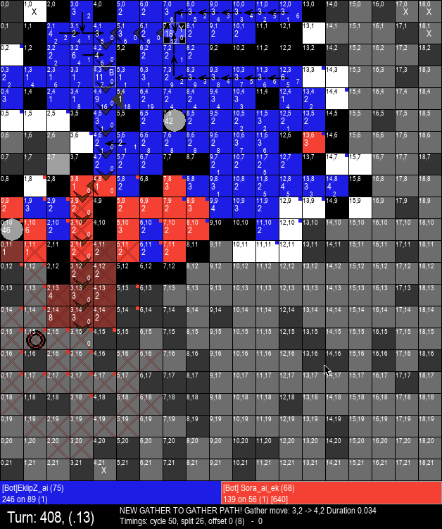

# Generals.io - Advanced player AI



## Synopsis

[Generals.io](http://generals.io) is a multiplayer web game where the goal is to protect your general and capture the enemy generals.  

This is EklipZ_ai on the bot server, and Human.exe on the human server.
EklipZ_ai / Human.exe is a generals bot that I wrote. It does not use machine learning; it is a purely algorithmic AI.

Its bot features include:
- Renders the visual state of the board (see sample gif above) including what it is thinking about, the most important thing it is doing that turn, and what it thinks the enemies board state is.
- Saves each GUI turn as a png in the logs folder for easy reference while debugging. Games can be stepped through visually by tabbing through images in the logs folder to see the board state while cross referencing the actual debug text log.

Its "AI" features include:
- Can consistently maintain a top 10 spot on the human 1v1 leaderboards and is certainly better than most humans, and can take games off of very good players.
- Very efficient gathering. (Its been a while but I believe it currently builds a minimum spanning tree, prunes least valuable branches, and then tries some quick non-mst path add-ons to the highest value branches to determine a good gather plan).
- Reasonably efficient expansion (heuristic DFS/BFS hunts sent out from larger army tiles, statelessly recalculated each turn during the attack/expansion phase of a round).
- Efficient attack timing with optimization for maximum damage to enemy each army bonus timing. (generally sameish algo as expansion with heuristic bonuses for controlling enemy tiles)
- Intelligent map control and exploration. (prioritizes middle of map and space around its king, and paths that explore more unexplored space)
- Maintains the state of what it believes is happening behind fog of war. (Including predicting that armies leaving fog of war came from nearby cities / tile lines and updating those tile amounts to 1 to let the bot plan attacks to cities it thinks have now been vacated etc)
- Predicts enemy general location based on where enemy tiles appear from. (Very intelligent general prediction, BFS's into fog of war every time an enemy army leaves the fog and gives a score to fog tiles based on their distance to the exiting army. The unexplored fog tiles with the best score throughout the game are predicted as the enemy general location. This is insanely accurate, even general-hiding-strategies tend to fail to keep their general location hidden from the AI for long)
- Has advanced defensive capabilities including intelligently intercepting the enemy army, intelligently blocking choke points, and fairly optimal defensive gathers. (uses some basic graph theory (as someone who doesn't know graph theory) to determine chokes between predicted enemy location and players general, and treats those tiles special during defensive gathers and attack-defense (because a choke can always be defended one turn later than an attack through a non-choke, letting the bot do other stuff once it knows the timing of a choke defense, etc))

Things it is missing as a bot:
- Has many bugs. Lots of off-by-one errors. This project was not intended to be my final AI and evolved with absolutely no unit testing or test harness infrastructure, and it was an early personal project back when I felt tests were boring and didn't want to write them. This is a huge mistake and shows my naievity as a software dev back then, I now love tests and am good at writing test infrastructure and much prefer reproducing issues in test and debugging there, rather than trying to sort through problems via logs.
- As such, this bot has many minor bugs all over the place and while it almost never crashes, it certainly makes mistakes or can get into repetition loops sometimes, its heuristic exploration, gathers, and defense gathers are not always perfect, etc. But it was very fun and is still by far the best generals AI I am aware of having existed.
- Currently doesn't work, generals changed some stuff with the websocket / websocket communication and now it gets disconnected after connecting, not sure why. :(

Places where it is lacking as a Generals player:
- Does not do a great job of preventing the discovery of its general.
- Does not do any advanced strategic play, for example using suboptimal attack routes to disguise the location of its general like some humans will do, etc.
- Does not do a fantastic job of managing large numbers of cities vs gathering late game. I never datamined top players to figure out some ratio of how long to let tiles sit vs how long to let cities sit before regathering them, etc. It tries to just gather the most troops it can each cycle, which is optimial play for that cycle but definitely suboptimal in the long run, as it tends to leave hard to gather chunks of the board completely ungathered and spend all its time re-gathering from cities and tiles near the engagement path etc.
- I never really figured out the math on time spent gathering vs attacking. It does adjust the timings based on theories I came up with that improve it somewhat, but top players have better instincts for how long to spend expanding and attacking, often.
- It is 1v1 optimized. It doesn't play FFAs particularly intelligently; while it does have some specific strategy differences in FFA (does not prioritize the middle of the map until down to 3 players, instead prioritizes map edges and city taking) but largely, the bot is optimized for 1v1 and while it can easily do well in an FFA, it is not a consistently good FFA player and does not try to be.


## Setup

- [ ] Python3.11+ (https://www.python.org/downloads/) or on windows with Chocolatey, as admin, run choco install python3
- [ ] Install Dependencies: `pip3 install -r requirements.txt`
- [ ] Update all the hardcoded paths to whatever you want them to be on your system, see https://github.com/EklipZgit/generals-bot/commit/76b114c4d6bd551dd273fe9192e82a5690ea260e

## Usage

Powershell:
```Powershell
. ".\run-bot.ps1"
run-bot -game 1v1, 1v1, 1v1, ffa, ffa -name "EklipZ_ai" -right [-noui]
```
Ask me questions in discord! @EklipZ#3166 https://discord.gg/tchBMdN

DO NOT run this on the human servers when it is not working. The reason bots were banned on the human server was due to poor/crashing/afk/random-move bots taking up games on the human server which led to boring games and wasted peoples time. Do not contribute to that problem. Get everything working on the bot server, and get your bot up to par where it is at least challenging to play against for some humans before even considering running it on the Human server. Thank you!

## Contributors

@harrischristiansen [HarrisChristiansen.com](http://www.harrischristiansen.com) (harris@harrischristiansen.com)  Original source

@EklipZgit (me) forked and wrote the bot portion from scratch for EklipZ_ai AKA Human.exe


## Other interesting links:
Another older bot that is fun (but not as good as EklipZ_ai anymore):
Sora AI: https://github.com/toshima/generals-ai